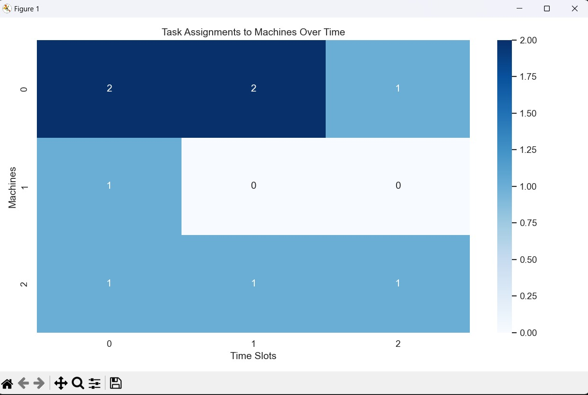

# Task Scheduling in Edge Server Systems

## 1. Introduction:

This folder contains a C++ implementation of a task scheduling algorithm for edge server systems with limited solar energy and infinite batteries. The solution aims to efficiently allocate tasks to edge servers while maximizing task execution rates and optimizing resource utilization.

## 2. Implementation Files:

`task_scheduling.cpp:` This file contains the main implementation of the task scheduling algorithm. It includes functions for task allocation, energy calculation, and task assignment. The algorithm dynamically assigns tasks based on real-time solar energy availability, task arrival rates, and battery utilization.
expander.py: This Python script is utilized to expand the generated CSV file containing task assignments into a more readable format or visualize the results if necessary.
## 3. How to Use:

`Compilation:` Compile the task_scheduling.cpp file using a C++ compiler (e.g., g++).
`For windows:` 
```
>>g++ .\task_scheduling.cpp
>>.\a.exe
```
at the end of execution we visualize the solution like:


Execution: Run the compiled executable. It prompts the user to input the number of edge servers, time slots, upper bound on energy, solar power generation for each edge server, and the number of tasks arriving at each edge server for each time slot.
Output: The program outputs the assignment of tasks to machines at different timestamps and generates a CSV file named "schedule.csv" containing the task assignments.
## 4. Requirements:

C++ compiler (e.g., g++)
Python (for executing visualizer.py if visualization is needed)

## 5. Example Usage:

```
Enter the number of edge servers (M): 3

Enter the number of time slots (T): 3

Enter the upper bound on energy (S_max): 123
Enter solar power generation for each edge server and each time slot(MxT):
16 1 1
1 0 0
1 1 1
Enter the number of tasks arriving at each edge server and each time slot(MxT):
1 1 1
2 1 1
1 2 1
assignment of task to machines at different time timestamps(M*T):
2 2 1
1 0 0
1 1 1
```
## 6. Output:

The program outputs the assignment of tasks to edge servers at different timestamps, providing insights into task execution rates and resource utilization. Additionally, it generates a CSV file named "schedule.csv" for further analysis or visualization using the provided Python script.

## 7. Author:

Harsh Katara(210101045), Anand Keshav(210101014), Yash Raj Singh(210101113)

## 8. License:

This README provides an overview of the task scheduling algorithm implemented in C++, instructions for usage, example input/output, and considerations for further customization or optimization.